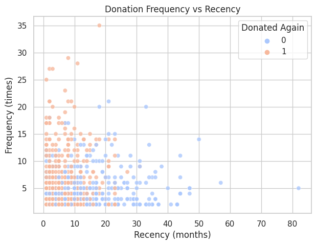
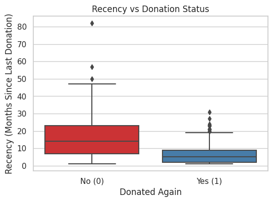
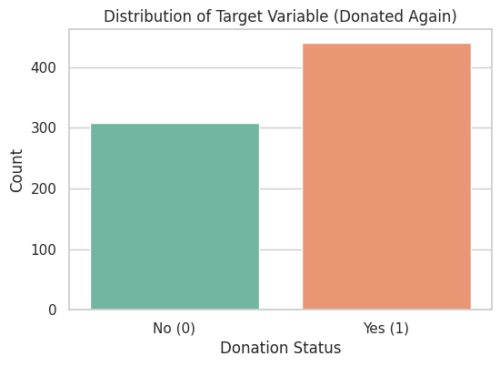

# Predictive Healthcare Analytics: Blood Donation Forecasting & Retention

## 📊 Executive Summary
Blood collection centers face critical supply chain vulnerabilities: short shelf lives for blood products (platelets expire within 5–7 days) mean that under-collection delays critical surgeries, while over-collection results in costly waste. 

This project addresses this optimization problem by applying the marketing **RFM (Recency, Frequency, Monetary)** framework to historical donor behavior. Using machine learning, the model forecasts the probability of a donor returning within a target window, paired with an interactive Tableau dashboard to track ongoing donor operational metrics.

---

## 🎯 Business Objectives
* **Inventory Stabilization:** Predict incoming blood supply volume to match hospital demand profiles and reduce spoilage rates.
* **Targeted Engagement:** Segregate high-probability return donors from lapsed donors to optimize marketing outreach spend.
* **Operational Visibility:** Provide regional inventory managers with a clear view of donor recency metrics.

---

## 🛠️ Data & Methodology
The project leverages four primary operational metrics to assess donor patterns:
1. **Recency (months):** Elapsed time since the last donation.
2. **Frequency (times):** Total historical volume of donations made.
3. **Monetary (c.c. blood):** Total volume of blood donated (1 donation = 250 c.c.).
4. **Time (months):** Total time active since the donor's first registration.

---

## 📈 Visual Insights & Dashboard Layout

### 1. Target Class Baseline
This distribution shows the underlying target balance within our donor registry, establishing our baseline retention rate.

### 2. Recency Analysis (Boxplot Summary)
**Key Finding:** There is a distinct divergence in timelines. Returning donors exhibit a significantly lower median recency (concentrated under 6 months) compared to non-returning profiles. This mathematically highlights that *immediate, short-term re-engagement* yields higher conversions than waiting for a profile to completely lapse.

### 3. Frequency vs. Recency Dynamic Clustering
**Key Finding:** Plotting these features reveals a high-density "sweet spot" in the upper-left quadrant (high frequency, low recency). This represents the champion donor core.

---

## 🚀 Operational Recommendations
1. **Automated Re-engagement Pipelines:** Set automated email/SMS triggers to fire exactly when a high-frequency donor hits the 3-month post-donation mark.
2. **Dynamic Collection Logistics:** Tie marketing drive locations directly to areas showing low average recency metrics to stabilize regional collection pipelines.
3. **Tableau Integration:** Connect this model output directly to a live Tableau Public interactive dashboard for daily monitoring by clinic logistics coordinators.
